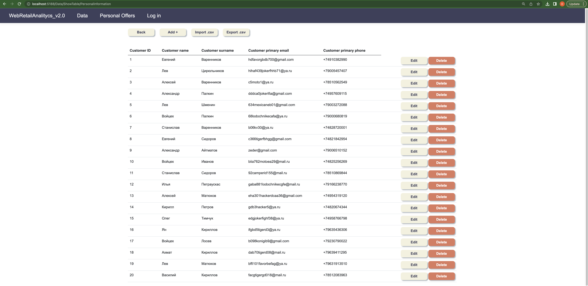

# EntityFrameworkPractice
В этом проекте я знакомился с ORM фреймворком, рефлексией и ASP.NET Core MVC.
Задача состояла в создании сервера базы данных, бэкэнда и веб страницы, на которой отображаются таблицы с возможностью CRUD операций.

Проект был командным, моя часть отвечала за подключение к базе данных, созданию её контекста (на 80% генерировался автоматически), написанию контроллеров, биндера и всего, что касалось CRUD операций, а так же, написание большей части кода самой базы данных по описанию таблиц в задании.

